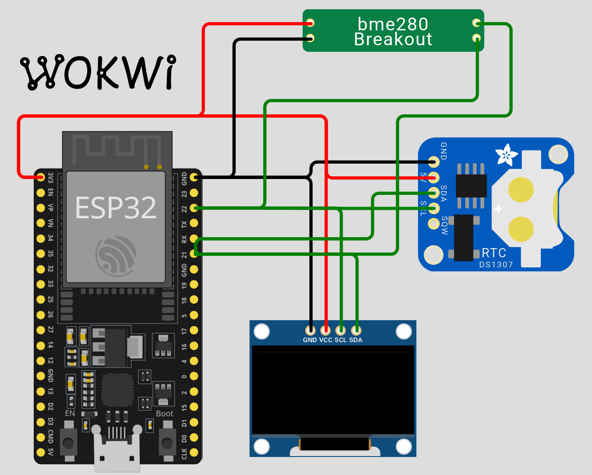

# FreeRTOS, esp32 bme280 ds3231 sh1106
Simple example of get started to learn FreeRTOS on PlatformIO (VSCODE, Arduino framefork) with esp32.

Read Temperature, Pressure, Humidity from Bosch sensor BME280,
use RTC ds3231 to sync time with NTP server (lib time.h),
and print it to OLED display SH1106. 

 

Time and values of Temperature, Pressure, Humidity sent to ThingSpeak.com  

Closed, nothing intereting. FreeRTOS don't work good. Maybe it is bad chinee hardware, maybe it is problem with soft :-(    
  
